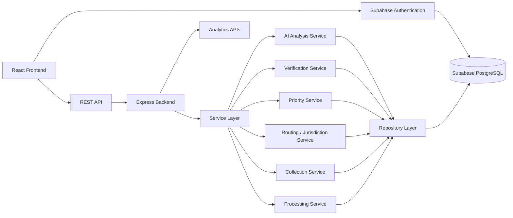

# Architecture

[← Back to README](../README.md)

## System Diagram



---

## Request Walkthrough

### Example: Citizen submits a construction-waste report

1. Citizen opens the report wizard and enters waste details, location, quantity and image.
2. React frontend validates the input using React Hook Form and Zod.
3. Frontend sends `POST /api/reports` to the Express backend.
4. Backend validates the request and creates the report through `ReportRepository`.
5. The AI Analysis Service evaluates the submitted image/data and produces prototype analysis such as waste composition, recyclability, contamination, image quality and duplicate probability.
6. Verification Service checks for possible duplicate or nearby reports.
7. Priority Service calculates a priority level using factors such as quantity, waste type, age, location sensitivity, recyclability and duplicate probability.
8. Routing/Jurisdiction Service determines the applicable demonstration collection zone.
9. The report is assigned to the appropriate collection workflow.
10. Collection and processing teams update the report as it moves through collection, sorting, processing and recycling.
11. Analytics APIs aggregate operational and impact data for the admin dashboard.

---

## Components

| Component | Responsibility | Technology | Code location |
|---|---|---|---|
| Frontend | Citizen and operational dashboards, report wizard and workflow UI | React, TypeScript, Vite, Tailwind, shadcn/ui | `src/frontend/` |
| API | REST API and request handling | Node.js, Express, TypeScript | `src/backend/` |
| Authentication | User authentication | Supabase Authentication | Supabase / frontend |
| Validation | Request and form validation | Zod | `src/backend/`, `src/frontend/` |
| Service Layer | Business logic for analysis, verification, prioritization, routing, collection and processing | TypeScript | `src/backend/` |
| Repository Layer | Data-access abstraction between services and persistence | TypeScript | `src/backend/` |
| AI Analysis | Prototype construction-waste image/data analysis | TypeScript prototype service | `src/backend/` |
| Database | Persistent application data | Supabase PostgreSQL | Supabase / repository layer |
| Maps | Location display and mapping | Leaflet, OpenStreetMap | `src/frontend/` |
| Analytics | Operational and environmental impact metrics | REST APIs, Recharts | `src/backend/`, `src/frontend/` |

---

## Data Model

| Entity | Key fields | Notes |
|---|---|---|
| `profiles` | `id`, `role`, `name`, `phone` | Application users and role information |
| `reports` | `id`, `reporter_id`, `waste_type`, `quantity`, `location`, `status`, `priority` | Main construction-waste report |
| `report_images` | `id`, `report_id`, `image_url` | Images attached to reports |
| `ai_analysis` | `report_id`, `composition`, `recyclability`, `contamination`, `duplicate_probability`, `confidence` | Prototype AI analysis results |
| `report_verification` | `report_id`, `verification_status`, `verified_by`, `notes` | Verification outcome |
| `report_timeline` | `report_id`, `status`, `timestamp`, `actor` | Traceability of report lifecycle |
| `collection_teams` | `id`, `name`, `zone`, `status` | Collection team information |
| `collection_assignments` | `report_id`, `team_id`, `assigned_at`, `status` | Links reports to collection teams |
| `collection_proofs` | `assignment_id`, `image_url`, `latitude`, `longitude` | Collection completion evidence |
| `processing_batches` | `id`, `batch_code`, `status`, `processed_at` | Processing and recycling batches |
| `material_recovery` | `batch_id`, `material_type`, `input_quantity`, `recovered_quantity` | Material recovery information |
| `recycled_products` | `recovery_id`, `product_name`, `quantity` | Recycled output products |
| `notifications` | `id`, `user_id`, `type`, `message`, `read` | Workflow notifications |

---

## Report Lifecycle

```text
SUBMITTED
    ↓
AI_ANALYZED
    ↓
VERIFICATION_PENDING
    ↓
VERIFIED
    ↓
ASSIGNED
    ↓
COLLECTED
    ↓
SORTING
    ↓
PROCESSING
    ↓
RECYCLED
```

Reports may also move to states such as `REJECTED`, `DUPLICATE` or `CANCELLED` when applicable.

---

## Key APIs

| Method | Endpoint | Purpose |
|---|---|---|
| POST | `/api/reports` | Create a construction-waste report |
| GET | `/api/reports` | Retrieve reports |
| GET | `/api/reports/:id` | Retrieve a specific report |
| POST | `/api/reports/:id/analyze` | Run AI analysis |
| POST | `/api/reports/:id/verify` | Verify a report |
| POST | `/api/reports/:id/calculate-priority` | Calculate report priority |
| GET | `/api/reports/:id/routing` | Determine routing/jurisdiction |
| POST | `/api/reports/:id/assign` | Assign a report to a collection team |
| GET | `/api/collections` | Collection workflow data |
| GET | `/api/processing` | Processing workflow data |
| GET | `/api/analytics/...` | Analytics and impact metrics |
| GET | `/api/notifications` | User notifications |

---

## API Response Format

### Success

```json
{
  "success": true,
  "data": {}
}
```

### Error

```json
{
  "success": false,
  "error": {
    "code": "ERROR_CODE",
    "message": "Description of the error"
  }
}
```

---

## Tech Stack

| Layer | Choice | Why |
|---|---|---|
| Frontend | React + TypeScript + Vite | Component-based architecture and fast development |
| UI | Tailwind CSS + shadcn/ui | Consistent and reusable interface components |
| Backend | Node.js + Express + TypeScript | Lightweight REST API and shared TypeScript types |
| Validation | Zod | Runtime validation for API and form inputs |
| Database | Supabase PostgreSQL | Relational data model suitable for workflow and traceability |
| Authentication | Supabase Authentication | Application user authentication |
| AI | Prototype AI Analysis Service | Supports waste classification, recyclability and verification signals |
| Maps | Leaflet + OpenStreetMap | Lightweight map integration |
| Charts | Recharts | Dashboard analytics and impact visualisation |
| Hosting | Vercel | Deployment of the web application |

---

## Data Sources

| Dataset | Source | Real or synthetic | Used for |
|---|---|---|---|
| Construction-waste reports | Project-generated demo records | Synthetic | Demonstrating report and workflow management |
| Collection zones | Project-defined demonstration zones around Mysuru | Synthetic/demo | Demonstrating routing and assignment |
| Map data | OpenStreetMap | Real | Location and map visualisation |
| Processing/recovery records | Project-generated demo records | Synthetic | Demonstrating traceability and impact metrics |

---

## Architecture Principles

- **Modular services:** Business logic is separated into focused services.
- **Repository abstraction:** Data access is separated from business logic.
- **Traceability:** Reports can be followed from submission through collection, processing and recycling.
- **Validation-first APIs:** API inputs are validated before business logic executes.
- **Prototype-aware AI:** AI outputs are treated as analysis signals rather than unquestioned ground truth.
- **Demo-safe geography:** Collection zones are clearly treated as demonstration data and not official municipal boundaries.
- **Persistent data:** Supabase PostgreSQL provides persistent application storage.
- **Authenticated access:** Supabase Authentication provides application-level user authentication.

---

## Security and Configuration

- Secrets and API keys are stored through environment variables.
- `.env` files are excluded from Git.
- Backend validation prevents malformed API requests.
- Role-based application workflows restrict dashboard functionality according to the authenticated user's role.
- Supabase Authentication provides application-level user authentication.
- Production municipal authorization, government-grade identity verification and institutional identity integration are outside the scope of the MVP.

---

## Supabase Integration

Supabase provides the persistent backend services used by the final MVP.

### Authentication

Supabase Authentication is used for application user authentication. User profile and role information are associated with the application's user model.

### Database

Supabase PostgreSQL stores persistent application data including:

- User profiles
- Waste reports
- Report images and analysis information
- Verification records
- Report lifecycle events
- Collection assignments
- Collection evidence
- Processing batches
- Material recovery
- Recycled products
- Notifications

### Application Flow

```text
User
  ↓
Supabase Authentication
  ↓
React Frontend
  ↓
REST API
  ↓
Express Backend
  ↓
Service Layer
  ↓
Repository Layer
  ↓
Supabase PostgreSQL
```

Supabase is therefore part of the final application architecture rather than a future integration.